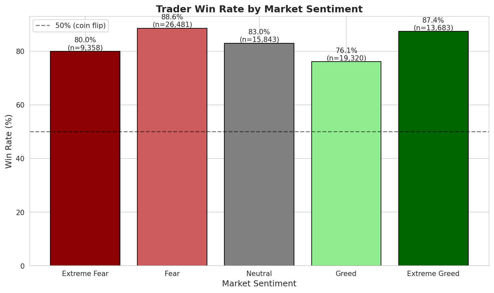
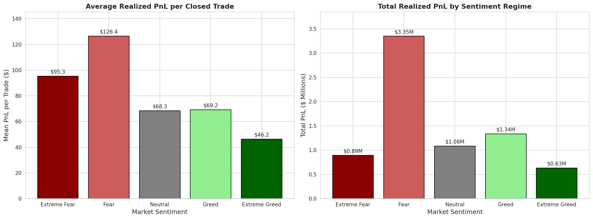
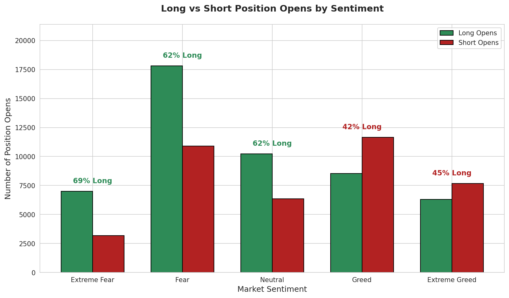
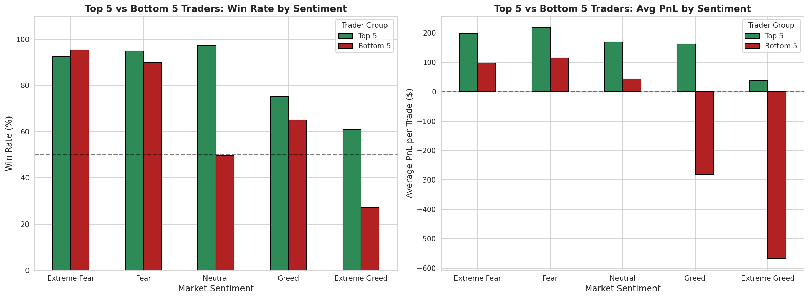
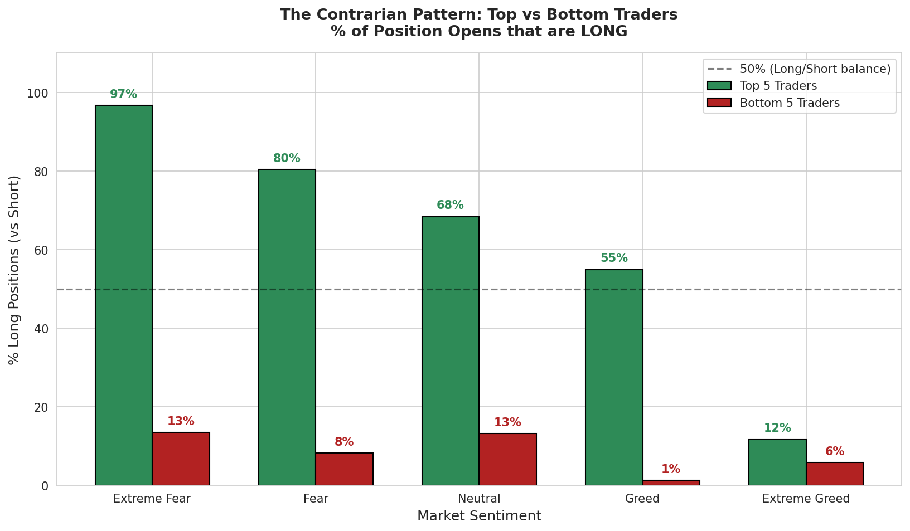
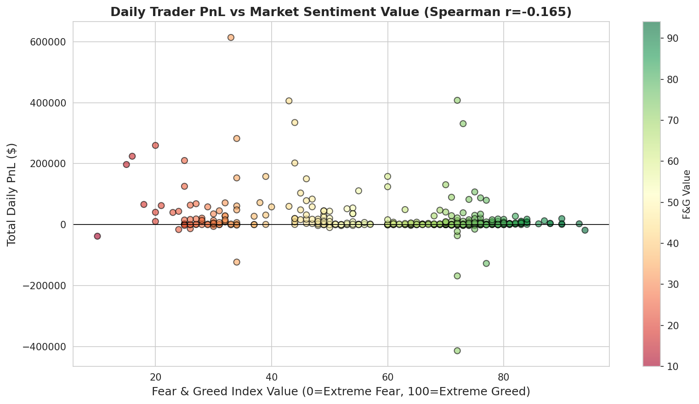
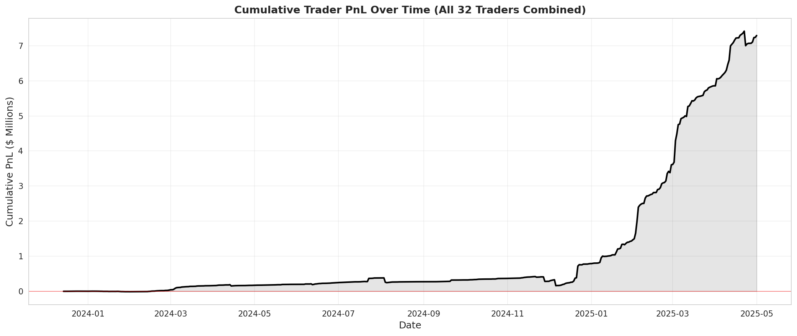

# Trader Performance vs Market Sentiment

**Primetrade.ai Round-0 Task | June 2026**

---

## Executive Summary

Across 32 traders and 211,224 trades on Hyperliquid (May 2023 – May 2025), merged with daily Crypto Fear & Greed Index data, three findings emerge:

1. **Traders earn 2.7× more per trade during Fear than during Extreme Greed** ($126 vs $46). The Mann-Whitney U test confirms this is highly significant (p < 0.001).
2. **The top 5 traders by total PnL are aggressively contrarian**   97% long during Extreme Fear, only 12% long during Extreme Greed. The bottom 5 are perma-short across all regimes and lose money specifically when sentiment is greedy.
3. **Daily total PnL is negatively correlated with the Fear & Greed value** (Spearman ρ = −0.17, p < 0.001)   as the crowd gets greedier, profits shrink.

**Headline takeaway:** Among the 32 traders studied, performance dispersion is dominated by directional bias conditioned on sentiment. A simple contrarian framework   long during fear, short during extreme greed   matches the historical winners' pattern.

---

## 1. Data Overview

| Dataset | Rows | Time Range | Unique Entities |
|---|---|---|---|
| Hyperliquid trader data | 211,224 | May 2023 – May 2025 | 32 accounts, 246 coins |
| Crypto Fear & Greed Index | 2,644 | Feb 2018 – May 2025 | 5 sentiment buckets |

**Merge:** Performed on date. Only 6 of 211,224 trades (0.003%) failed to match a sentiment record   dropped without consequence.

**Data quality notes:**
- The task description specified a `leverage` column. **The provided CSV does not contain leverage data.** All leverage-conditioned analysis is therefore excluded.
- The `event` column referenced in the task corresponds to `Direction` in the CSV (Open/Close Long/Short).
- `Closed PnL` is populated only on close events; open events have PnL = 0 by design.
- 32 traders is a small, curated sample   findings describe these specific traders, not the broader market.

---

## 2. Methodology

The analysis follows four steps:

1. **Load** both CSVs into pandas, parse timestamps (DD-MM-YYYY HH:MM format for trades, ISO date for sentiment).
2. **Merge** trades to sentiment on date, attaching each trade's daily classification and numeric F&G value.
3. **Segment** trades into close events (for PnL analysis) and open events (for directional bias analysis).
4. **Aggregate and test**   group by sentiment, compute summary stats, run Mann-Whitney U for Fear-vs-Greed PnL difference, and Pearson/Spearman correlation for daily PnL vs F&G value.

All charts are reproducible from `analysis.py` or `analysis.ipynb`.

---

## 3. Findings

### 3.1 Win Rate by Sentiment

| Sentiment | Win Rate | Trades |
|---|---|---|
| Extreme Fear | 80.0% | 9,358 |
| **Fear** | **88.6%** | 26,481 |
| Neutral | 83.0% | 15,843 |
| Greed | 76.1% | 19,320 |
| Extreme Greed | 87.4% | 13,683 |

Win rate is highest during Fear (88.6%) and Extreme Greed (87.4%), and lowest during plain Greed (76.1%). The U-shape suggests these traders perform best when sentiment is decisively one-sided. Middle-Greed appears to be the worst environment, likely because the directional signal is ambiguous and traders get whipsawed.

### 3.2 Realized PnL by Sentiment

| Sentiment | Mean PnL | Median PnL | Total PnL |
|---|---|---|---|
| Extreme Fear | $95.25 | $8.05 | $891,391 |
| **Fear** | **$126.41** | $7.11 | **$3,347,568** |
| Neutral | $68.32 | $4.40 | $1,082,347 |
| Greed | $69.17 | $3.98 | $1,336,414 |
| Extreme Greed | $46.23 | $7.13 | $632,537 |

**Mann-Whitney U test (Fear days vs Greed days):**
- Fear days mean: **$118.28** / Greed days mean: **$59.66**
- U = 635,881,467, **p < 10⁻⁶**

This is the core finding: the most profitable environment for this cohort is moderate Fear, not Greed. Of $7.3M total profit, $3.35M (46%) was earned during 'Fear' regimes alone   far more than any other bucket.

### 3.3 Long vs Short Bias by Sentiment

| Sentiment | Long Opens | Short Opens | % Long |
|---|---|---|---|
| Extreme Fear | 7,005 | 3,174 | **68.8%** |
| Fear | 17,824 | 10,887 | 62.1% |
| Neutral | 10,222 | 6,353 | 61.7% |
| Greed | 8,544 | 11,664 | 42.3% |
| Extreme Greed | 6,300 | 7,663 | **45.1%** |

The cohort exhibits a clear contrarian directional bias. As sentiment shifts from Extreme Fear to Greed, the long-bias drops from 69% to 42%   they buy fear and fade greed. The relationship is monotonic.

### 3.4 Top vs Bottom Traders   The Headline Finding

| Trader Group | Total PnL | Trades |
|---|---|---|
| Top 5 | **$4,613,792** | ~22,224 closes |
| All 32 (combined) | $7,290,257 | 84,685 closes |
| Bottom 5 | **−$235,818** | 4,123 closes |

The top 5 traders earned more than the remaining 27 traders combined. But **what** they do differently is the interesting part:

| Sentiment | Top 5 % Long | Bottom 5 % Long |
|---|---|---|
| Extreme Fear | **97%** | 13% |
| Fear | 80% | 8% |
| Neutral | 68% | 13% |
| Greed | 55% | 1% |
| Extreme Greed | 12% | 6% |

The top traders go aggressively long during Extreme Fear (97%) and aggressively short during Extreme Greed (only 12% long). The bottom traders are essentially perma-short   they bet against the rebounds and got crushed.

The PnL impact is dramatic:
- **Top 5 average PnL during Extreme Greed: +$39 per trade**
- **Bottom 5 average PnL during Extreme Greed: −$568 per trade**

The bottom 5 lose specifically during Greed regimes (avg −$281 in Greed, −$568 in Extreme Greed) because they are betting against the market's momentum while it is most directional.

This is the highest-signal finding in the dataset: **position direction conditioned on sentiment explains most of the performance dispersion.**

### 3.5 Daily PnL vs Sentiment Score (Continuous View)

- **Pearson correlation:** r = −0.250, p < 10⁻⁶
- **Spearman correlation:** ρ = −0.165, p = 0.0008

The correlation is small in magnitude but statistically robust and consistent with every other finding: as the Fear & Greed value rises (market gets greedier), daily aggregate PnL falls.

### 3.6 Cumulative PnL Over Time

The cohort's cumulative PnL grows steadily over the two-year period to $7.3M, with no extended drawdowns. This is consistent with a strategy that generates positive expectancy across regimes   though, as shown above, the bulk of the gains come from Fear regimes.

---

## 4. Trading Strategy Implications

1. **The cohort's edge is contrarian, concentrated in Fear regimes.** A strategy that goes long during fear and short during greed (especially extreme greed) matches the winners' historical pattern.

2. **Greed periods are the danger zone for unsophisticated traders.** The bottom 5 traders lose virtually all their money during Greed and Extreme Greed regimes. Risk controls (smaller position size, tighter stops) should escalate as sentiment approaches greed extremes.

3. **Direction is more predictive than entry timing.** The dispersion between top and bottom traders is explained almost entirely by *which way* they were betting, not *when*. A simple rule   "don't be short during Extreme Fear, don't be long during Extreme Greed"   would have lifted several bottom-5 traders out of the loss column.

4. **The middle-Greed bucket is uniquely treacherous** (lowest win rate at 76%, lowest mean PnL at $69). Direction is ambiguous and traders get whipsawed. Position-sizing models could weight signals lower in this regime.

---

## 5. Limitations

- **Causation vs correlation:** The Fear & Greed value is partly a function of recent price action. We cannot claim sentiment *causes* trader outcomes   only that they co-move. Endogeneity is a real concern.
- **Sample size:** 32 traders is a small, curated set. Findings may not generalize to the broader retail population.
- **No leverage data:** The task description mentioned leverage, but it is absent from the CSV. Leverage-conditioned analyses (e.g., liquidation rates by sentiment) are not possible with the data provided.
- **Survivorship/selection effects:** Unknown whether the 32 accounts were selected for notability. Caveat all findings accordingly.
- **No regime-transition handling:** Sentiment buckets are point-in-time. Whipsaw behavior around regime transitions is not modeled and may matter for execution.
- **No volatility regime control:** Some of the Fear-vs-Greed performance gap may be driven by volatility differences (crypto bear markets have different volatility structure than bulls), which we did not isolate.

---

## 6. Conclusion

The single most important finding in this dataset is that **trader performance dispersion is dominated by directional bias conditioned on sentiment.** Top traders fade the crowd: long during Fear, short during Greed. Bottom traders are perma-short and bleed during rallies. The Fear regime is where most of the profit lives ($3.35M of $7.3M total   46% from 29% of trades).

The simplest actionable rule for this cohort is also the strongest: **be long during Fear, neutral-to-short during Greed, and especially cautious during Extreme Greed where the worst outcomes cluster.**

---

*Author: Shivam Tiwari (Forge)*  *|*  *Submission date: 8 June 2026*
